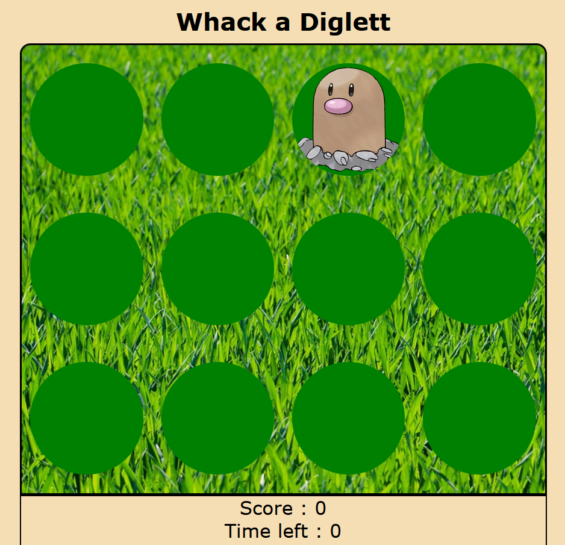

# Whack-A-Mole game

This project is a whack a mole clone so mine is called *Whack a Diglett* and you'll see why at the end of this read me 😄  
So as you may know the goal of this traditional game is to prevent "moles" from coming out the ground with a hammer.  
Every second a new "mole" appears and you'll have to click on it to gently tell her to go back into the soil where it belongs.  
To use it you have to click on the start button and you're ready to go.

## Technology used

For this project I used time outs and intervals so there's JavaScript.  
But I also used HTML and SCSS.

## Screen shot

